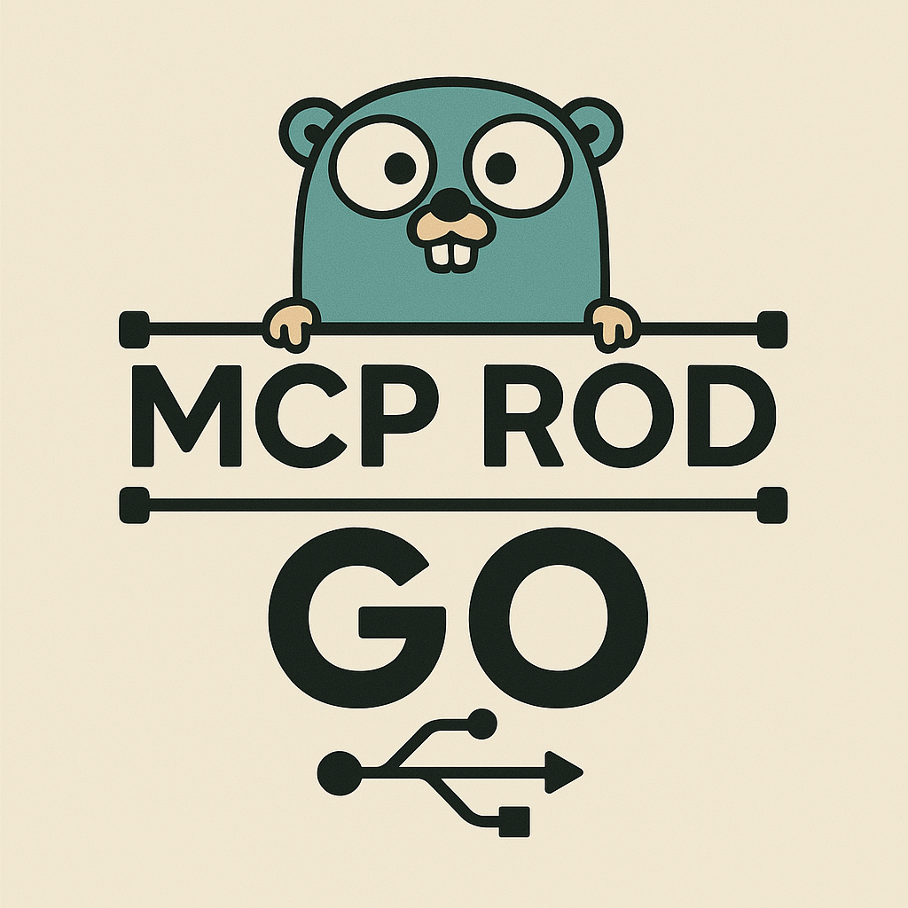

# Rod MCP Server

<div align="center">



**Browser automation for AI agents via the [Model Context Protocol](https://modelcontextprotocol.io/).**

Built on [Rod](https://github.com/go-rod/rod) — a fast, reliable Go library for controlling Chromium browsers.

[](https://github.com/aliwatters/rod-mcp/releases)
[](LICENSE)
[](https://go.dev)

</div>

---

Rod MCP gives AI agents (Claude, Cursor, etc.) full browser control — navigate pages, fill forms, click buttons, take screenshots, generate PDFs, and more. It works in two modes:

- **Text mode** (default): Uses accessibility snapshots for structured, token-efficient interaction
- **Vision mode**: Uses screenshots with coordinate-based clicking for visual AI models

## Quick Start

### Install

```bash
go install github.com/aliwatters/rod-mcp@latest
```

Or download a [pre-built binary](https://github.com/aliwatters/rod-mcp/releases) for your platform.

### Configure your MCP client

**Claude Desktop** (`~/Library/Application Support/Claude/claude_desktop_config.json`):

```json
{
  "mcpServers": {
    "rod-mcp": {
      "command": "rod-mcp",
      "args": ["--headless", "--no-banner", "--compact-snapshot"]
    }
  }
}
```

**Claude Code** (`~/.claude/settings.json`):

```json
{
  "mcpServers": {
    "rod-mcp": {
      "command": "rod-mcp",
      "args": ["--headless", "--no-banner", "--compact-snapshot"]
    }
  }
}
```

**Cursor** (`.cursor/mcp.json`):

```json
{
  "mcpServers": {
    "rod-mcp": {
      "command": "rod-mcp",
      "args": ["--headless", "--no-banner", "--compact-snapshot"]
    }
  }
}
```

That's it. Your AI agent can now browse the web.

## Tools

### Navigation

| Tool | Description |
|------|-------------|
| `rod_navigate` | Navigate to a URL |
| `rod_go_back` | Go back in browser history |
| `rod_go_forward` | Go forward in browser history |
| `rod_reload` | Reload the current page |

### Page Interaction (Text Mode)

| Tool | Description |
|------|-------------|
| `rod_snapshot` | Capture accessibility snapshot of the page |
| `rod_click` | Click an element by snapshot reference |
| `rod_hover` | Hover over an element |
| `rod_fill` | Type text into an input field |
| `rod_selector` | Select an option in a dropdown |

### Page Interaction (Vision Mode)

| Tool | Description |
|------|-------------|
| `rod_vision_click` | Click at x,y coordinates |
| `rod_vision_fill` | Click at coordinates and type text |

### Media

| Tool | Description |
|------|-------------|
| `rod_screenshot` | Take a PNG screenshot |
| `rod_pdf` | Generate a PDF of the page |

### Browser Control

| Tool | Description |
|------|-------------|
| `rod_evaluate` | Execute JavaScript in the browser |
| `rod_close_browser` | Close the browser |
| `rod_set_headers` | Set HTTP headers for requests |
| `rod_resize` | Set viewport size and device emulation |
| `rod_handle_dialog` | Handle JavaScript dialogs (alert, confirm, prompt) |
| `rod_configure` | Change headless mode or CDP endpoint at runtime |

### Tabs

| Tool | Description |
|------|-------------|
| `rod_tab_new` | Open a new tab |
| `rod_tab_list` | List all open tabs |
| `rod_tab_select` | Switch to a tab |
| `rod_tab_close` | Close a tab |

### Debugging

| Tool | Description |
|------|-------------|
| `rod_wait_for` | Wait for a selector or text to appear |
| `rod_console_messages` | Capture browser console output |
| `rod_network_requests` | Capture network requests |

### Input

| Tool | Description |
|------|-------------|
| `rod_press` | Press a keyboard key |
| `rod_file_upload` | Upload files to a file input |

## Configuration

### CLI Flags

```
--config, -c       Path to config file (default: ./rod-mcp.yaml)
--headless, -hl    Run browser without GUI
--vision, -vs      Enable vision mode (coordinate-based tools)
--compact-snapshot  Reduce snapshot size for fewer tokens
--output-dir       Directory for screenshots and PDFs
--omit-images      Don't include base64 images in responses
--cdp-endpoint     Connect to an existing browser via CDP
--chrome-debug-port  Launch Chrome with remote debugging on this port
--user-data-dir    Clone a Chrome profile directory (inherits cookies/sessions)
--clone-domains    Comma-separated domains to clone cookies for (e.g. "localhost,*.clerk.dev")
--no-clone         Use profile directly instead of cloning (locks your main Chrome)
--clone-all        Clone ENTIRE profile including passwords, history, extensions (slow!)
--no-banner        Suppress the startup banner
```

### Config File

Create a `rod-mcp.yaml` (one is generated automatically on first run):

```yaml
mode: text                    # text or vision
headless: false               # run without GUI
browserBinPath: ""            # path to Chrome/Chromium (auto-detected)
browserTempDir: ./rod/browser # browser profile directory
noSandbox: false              # disable Chrome sandbox
proxy: ""                     # proxy URL (e.g. socks5://localhost:1080)
compactSnapshot: false        # reduce tokens in snapshots
outputDir: ""                 # screenshot/PDF output (default: OS temp)
imageResponses: allow         # allow or omit inline base64 images
userDataDir: ""               # Chrome profile to clone (e.g. ~/Library/Application Support/Google/Chrome)
cloneDomains:                 # domains to clone cookies for (empty = all cookies)
  - "localhost"
  - "*.clerk.dev"

# Inject HTTP headers globally
extraHTTPHeaders:
  Authorization: "Bearer my-token"

# Inject headers for specific domains (supports wildcards)
domainHeaders:
  "*.example.com":
    X-Custom-Header: "value"
```

### Connecting to an Existing Browser

To control an already-running Chrome instance (useful for authenticated sessions):

**Option A** — Clone your Chrome profile (cookies, sessions, auth) for specific domains:
```bash
# macOS — clone only cookies for your app's domains
rod-mcp --user-data-dir "$HOME/Library/Application Support/Google/Chrome" \
        --clone-domains "localhost,*.clerk.dev,*.stripe.com"

# Linux
rod-mcp --user-data-dir "$HOME/.config/google-chrome" \
        --clone-domains "localhost,*.myapp.com"

# Clone all cookies (no domain filter)
rod-mcp --user-data-dir "$HOME/Library/Application Support/Google/Chrome"
```

By default, `--user-data-dir` **clones** the profile to a temp directory (cleaned up on exit) so your main Chrome stays usable. Only lightweight auth files are copied (cookies, local storage, preferences).

```bash
# Use profile directly without cloning (Chrome must not be running)
rod-mcp --user-data-dir "..." --no-clone

# ⚠️  Clone EVERYTHING — passwords, history, extensions, all browser data
# This is slow for large profiles and copies sensitive data to a temp directory
rod-mcp --user-data-dir "..." --clone-all
```

**Option B** — Let rod-mcp launch Chrome with debugging enabled:
```bash
rod-mcp --chrome-debug-port 9222
```

**Option C** — Launch Chrome yourself, then connect:
1. Launch Chrome with remote debugging:
   ```bash
   google-chrome --remote-debugging-port=9222
   ```

2. Connect rod-mcp:
   ```bash
   rod-mcp --cdp-endpoint http://127.0.0.1:9222
   ```

   Or use `rod_configure` at runtime to switch to a CDP endpoint.

## Docker

```bash
docker build -t rod-mcp .
docker run -i --rm rod-mcp
```

The container runs headless with Chromium. Mount a custom config:

```bash
docker run -i --rm -v ./rod-mcp.yaml:/app/rod-mcp.yaml:ro rod-mcp
```

Or use Docker Compose:

```bash
docker compose up --build
```

## Building from Source

```bash
git clone https://github.com/aliwatters/rod-mcp.git
cd rod-mcp
go build -o rod-mcp .
```

### Prerequisites

- Go 1.23+
- Chrome or Chromium

## Project Structure

```
rod-mcp/
├── main.go          # Entry point
├── cmd.go           # CLI flags and commands
├── server.go        # MCP server setup and tool registration
├── runner.go        # Server lifecycle
├── tools/           # All MCP tool implementations
│   ├── browser.go   #   evaluate, close, headers, resize, dialog
│   ├── configure.go #   runtime reconfiguration
│   ├── debug.go     #   wait_for, console, network
│   ├── input.go     #   keyboard, file upload
│   ├── media.go     #   screenshot, PDF
│   ├── navigation.go#   navigate, back, forward, reload
│   ├── snapshot.go  #   text mode: snapshot, click, hover, fill, selector
│   ├── tabs.go      #   tab management
│   └── vision.go    #   vision mode: coordinate click/fill
├── types/           # Config, context, snapshot, logging
├── utils/           # Shared utilities
├── banner/          # Startup banner
└── assets/          # Logo images
```

## Attribution

This project is a fork of [go-rod/rod-mcp](https://github.com/go-rod/rod-mcp) by the Go Rod Team. The original project provided the foundation for browser automation via the Model Context Protocol.

## License

MIT - see [LICENSE](LICENSE)
